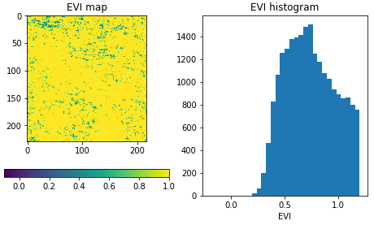

================
Getting Started
================

Connect to an openEO back-end
==============================

First, establish a connection to an openEO back-end, using its connection URL.
For example the VITO/Terrascope backend:

.. code-block:: python

    import openeo

    connection = openeo.connect("openeo.vito.be")

The resulting :py:class:`~openeo.rest.connection.Connection` object is your central gateway to

- list data collections, available processes, file formats and other capabilities of the back-end
- start building your openEO algorithm from the desired data on the back-end
- execute and monitor (batch) jobs on the back-end
- etc.

.. seealso::

    Use the `openEO Hub <http://hub.openeo.org/>`_ to explore different back-end options
    and their capabilities in a web-based way.

Collection discovery
=====================

The Earth observation data (the input of your openEO jobs) is organised in
`so-called collections <https://openeo.org/documentation/1.0/glossary.html#eo-data-collections>`_,
e.g. fundamental satellite collections like "Sentinel 1" or "Sentinel 2",
or preprocessed collections like "NDVI".

You can programmatically list the collections that are available on a back-end
and their metadata using methods on the `connection` object we just created
(like :py:meth:`~openeo.rest.connection.Connection.list_collection_ids`
or :py:meth:`~openeo.rest.connection.Connection.describe_collection`

.. code-block:: pycon

    >>> # Get all collection ids
    >>> connection.list_collection_ids()
    ['SENTINEL1_GRD', 'SENTINEL2_L2A', ...

    >>> # Get metadata of a single collection
    >>> connection.describe_collection("SENTINEL2_L2A")
    {'id': 'SENTINEL2_L2A', 'title': 'Sentinel-2 top of canopy ...', 'stac_version': '0.9.0', ...

Congrats, you now just did your first real openEO queries to the openEO back-end
using the openEO Python client library.

.. tip::
    The openEO Python client library comes with **Jupyter (notebook) integration** in a couple of places.
    For example, put ``connection.describe_collection("SENTINEL2_L2A")`` (without ``print()``)
    as last statement in a notebook cell
    and you'll get a nice graphical rendering of the collection metadata.

.. seealso::

    Find out more about data discovery, loading and filtering at :ref:`data_access_chapter`.

Authentication
==============

In the code snippets above we did not need to log in as a user
since we just queried publicly available back-end information.
However, to run non-trivial processing queries one has to authenticate
so that permissions, resource usage, etc. can be managed properly.

To handle authentication, openEO leverages `OpenID Connect (OIDC) <https://openid.net/connect/>`_.
It offers some interesting features (e.g. a user can securely reuse an existing account),
but is a fairly complex topic, discussed in more depth at :ref:`authentication_chapter`.

The openEO Python client library tries to make authentication as streamlined as possible.
In most cases for example, the following snippet is enough to obtain an authenticated connection:

.. code-block:: python

    import openeo

    connection = openeo.connect("openeo.vito.be").authenticate_oidc()

This statement will automatically reuse a previously authenticated session, when available.
Otherwise, e.g. the first time you do this, some user interaction is required
and it will print a web link and a short *user code*, for example:

.. code-block::

    To authenticate: visit https://aai.egi.eu/auth/realms/egi/device and enter the user code 'SLUO-BMUD'.

Visit this web page in a browser, log in there with an existing account and enter the user code.
If everything goes well, the ``connection`` object in the script will be authenticated
and the back-end will be able to identify you in subsequent requests.

.. _basic_example_evi_map_and_timeseries:

Example use case: EVI map and timeseries
=========================================

A common task in earth observation is to apply a formula to a number of spectral bands
in order to compute an 'index', such as NDVI, NDWI, EVI, ...
In this tutorial we'll go through a couple of steps to extract
EVI (enhanced vegetation index) values and timeseries,
and discuss some openEO concepts along the way.

Loading an initial data cube
=============================

For calculating the EVI, we need the reflectance of the
red, blue and (near) infrared spectral components.
These spectral bands are part of the well-known Sentinel-2 data set
and is available on the current back-end under collection id ``SENTINEL2_L2A``.
We load an initial small spatio-temporal slice (a data cube) as follows:

.. code-block:: python

    sentinel2_cube = connection.load_collection(
        "SENTINEL2_L2A",
        spatial_extent={"west": 5.14, "south": 51.17, "east": 5.17, "north": 51.19},
        temporal_extent = ["2021-02-01", "2021-04-30"],
        bands=["B02", "B04", "B08"]
    )

Note how we specify a the region of interest, a time range and a set of bands to load.

.. important::
    By filtering as early as possible (directly in :py:meth:`~openeo.rest.connection.Connection.load_collection` in this case),
    we make sure the back-end only loads the data we are interested in
    for better performance and keeping the processing costs low.

.. seealso::
    See the chapter :ref:`data_access_chapter` for more details on data discovery,
    general data loading (:ref:`data-loading-and-filtering`) and filtering
    (e.g. :ref:`filtering-on-temporal-extent-section`).

The :py:meth:`~openeo.rest.connection.Connection.load_collection` method on the connection
object created a :py:class:`~openeo.rest.datacube.DataCube` object (variable ``sentinel2_cube``).
This :py:class:`~openeo.rest.datacube.DataCube` class of the openEO Python Client Library
provides loads of methods corresponding to various openEO processes,
e.g. for masking, filtering, aggregation, spectral index calculation, data fusion, etc.
In the next steps we will illustrate a couple of these.

.. important::
    It is important to highlight that we *did not load any real EO data* yet.
    Instead we just created an abstract *client-side reference*,
    encapsulating the collection id, the spatial extent, the temporal extent, etc.
    The actual data loading will only happen at the back-end
    once we explicitly trigger the execution of the data processing pipeline we are building.

Band math
=========

From this data cube, we can now select the individual bands
with the :py:meth:`DataCube.band() <openeo.rest.datacube.DataCube>` method
and rescale the digital number values to physical reflectances:

.. code-block:: python

    blue = sentinel2_cube.band("B02") * 0.0001
    red = sentinel2_cube.band("B04") * 0.0001
    nir = sentinel2_cube.band("B08") * 0.0001

We now want to compute the enhanced vegetation index
and can do that directly with these band variables:

.. code-block:: python

    evi_cube = 2.5 * (nir - red) / (nir + 6.0 * red - 7.5 * blue + 1.0)

.. important::
    As noted before: while this looks like an actual calculation,
    there is *no real data processing going on here*.
    The ``evi_cube`` object at this point is just an abstract representation
    of our algorithm under construction.
    The mathematical operators we used here are *syntactic sugar*
    for expressing this part of the algorithm in a very compact way.

    As an illustration of this, let's have peek at the *JSON representation*
    of our algorithm so far, the so-called *openEO process graph*:

    .. code-block:: text

        >>> print(evi_cube.to_json(indent=None))
        {"process_graph": {"loadcollection1": {"process_id": "load_collection", ...
        ... "id": "SENTINEL2_L2A", "spatial_extent": {"west": 5.15, "south": ...
        ... "multiply1": { ... "y": 0.0001}}, ...
        ... "multiply3": { ... {"x": 2.5, "y": {"from_node": "subtract1"}}} ...
        ...

    Note how the ``load_collection`` arguments, rescaling and EVI calculation aspects
    can be deciphered from this.
    Rest assured, as user you normally you don't have to worry too much
    about these process graph details,
    the openEO Python Client library handles this behind the scenes for you.

Download (synchronously)
========================

Let's download this as a GeoTIFF file.
Because GeoTIFF does not support a temporal dimension,
we first eliminate it by taking the temporal maximum value for each pixel:

.. code-block:: python

    evi_composite = evi_cube.max_time()

.. note::

    This :py:meth:`~openeo.rest.datacube.DataCube.max_time()` is not an official openEO process
    but one of the many *convenience methods* in the openEO Python Client Library
    to simplify common processing patterns.
    It implements a ``reduce`` operation along the temporal dimension
    with a ``max`` reducer/aggregator.

Now we can download this to a local file:

.. code-block:: python

    evi_composite.download("evi-composite.tiff")

This download command **triggers the actual processing** on the back-end:
it sends the process graph to the back-end and waits for the result.
It is a *synchronous operation* (the :py:meth:`~openeo.rest.datacube.DataCube.download()` call
blocks until the result is fully downloaded) and because we work on a small spatio-temporal extent,
this should only take a couple of seconds.

If we inspect the downloaded image, we see that the maximum EVI value is heavily impacted
by cloud related artefacts, which makes the result barely usable.
In the next steps we will address cloud masking.

Batch Jobs (asynchronous execution)
===================================

Synchronous downloads are handy for quick experimentation on small data cubes,
but if you start processing larger data cubes, you can easily
hit *computation time limits* or other constraints.
For these larger tasks, it is recommended to work with **batch jobs**,
which allow you to work asynchronously:
after you start your job, you can disconnect (stop your script or even close your computer)
and then minutes/hours later you can reconnect to check the batch job status and download results.
The openEO Python Client Library also provides helpers to keep track of a running batch job
and show a progress report.

.. seealso::

    See :ref:`batch-jobs-chapter` for more details.

Applying a cloud mask
=========================

As mentioned above, we need to filter out cloud pixels to make the result more usable.
It is very common for earth observation data to have separate masking layers that for instance indicate
whether a pixel is covered by a (type of) cloud or not.
For Sentinel-2, one such layer is the "scene classification" layer generated by the Sen2Cor algorithm.
In this example, we will use this layer to mask out unwanted data.

First, we load a new ``SENTINEL2_L2A`` based data cube with this specific ``SCL`` band as single band:

.. code-block:: python

    s2_scl = connection.load_collection(
        "SENTINEL2_L2A",
        spatial_extent={"west": 5.14, "south": 51.17, "east": 5.17, "north": 51.19},
        temporal_extent = ["2021-02-01", "2021-04-30"],
        bands=["SCL"]
    )

Now we can use the compact "band math" feature again to build a
binary mask with a simple comparison operation:

.. code-block:: python

    # Select the "SCL" band from the data cube
    scl_band = s2_scl.band("SCL")
    # Build mask to mask out everything but class 4 (vegetation)
    mask = (scl_band != 4)

Before we can apply this mask to the EVI cube we have to resample it,
as the "SCL" layer has a "ground sample distance" of 20 meter,
while it is 10 meter for  the "B02", "B04" and "B08" bands.
We can easily do the resampling by referring directly to the EVI cube.

.. code-block:: python

    mask_resampled = mask.resample_cube_spatial(evi_cube)

    # Apply the mask to the `evi_cube`
    evi_cube_masked = evi_cube.mask(mask_resampled)

We can now download this as a GeoTIFF, again after taking the temporal maximum:

.. code-block:: python

    evi_cube_masked.max_time().download("evi-masked-composite.tiff")

Now, the EVI map is a lot more valuable, as the non-vegetation locations
and observations are filtered out:

.. image:: _static/images/basics/evi-masked-composite.png

Aggregated EVI timeseries
===========================

A common type of analysis is aggregating pixel values over one or more regions of interest
(also known as "zonal statistics) and tracking this aggregation over a period of time as a timeseries.
Let's extract the EVI timeseries for these two regions:

.. code-block:: python

    features = {"type": "FeatureCollection", "features": [
        {
            "type": "Feature", "properties": {},
            "geometry": {"type": "Polygon", "coordinates": [[
                [5.1417, 51.1785], [5.1414, 51.1772], [5.1444, 51.1768], [5.1443, 51.179], [5.1417, 51.1785]
            ]]}
        },
        {
            "type": "Feature", "properties": {},
            "geometry": {"type": "Polygon", "coordinates": [[
                [5.156, 51.1892], [5.155, 51.1855], [5.163, 51.1855], [5.163, 51.1891], [5.156, 51.1892]
            ]]}
        }
    ]}

.. note::

    To have a self-containing example we define the geometries here as an inline GeoJSON-style dictionary.
    In a real use case, your geometry will probably come from a local file or remote URL.
    The openEO Python Client Library supports alternative ways of specifying the geometry
    in methods like :py:meth:`~openeo.rest.datacube.DataCube.aggregate_spatial()`, e.g.
    as Shapely geometry objects.

Building on the experience from previous sections, we first build a masked EVI cube
(covering a longer time window than before):

.. code-block:: python

    # Load raw collection data
    sentinel2_cube = connection.load_collection(
        "SENTINEL2_L2A",
        spatial_extent={"west": 5.14, "south": 51.17, "east": 5.17, "north": 51.19},
        temporal_extent = ["2020-01-01", "2021-12-31"],
        bands=["B02", "B04", "B08", "SCL"],
    )

    # Extract spectral bands and calculate EVI with the "band math" feature
    blue = sentinel2_cube.band("B02") * 0.0001
    red = sentinel2_cube.band("B04") * 0.0001
    nir = sentinel2_cube.band("B08") * 0.0001
    evi = 2.5 * (nir - red) / (nir + 6.0 * red - 7.5 * blue + 1.0)

    # Use the scene classification layer to mask out non-vegetation pixels
    scl = sentinel2_cube.band("SCL")
    evi_masked = evi.mask(scl != 4)

Now we use the :py:meth:`~openeo.rest.datacube.DataCube.aggregate_spatial()` method
to do spatial aggregation over the geometries we defined earlier.
Note how we can specify the aggregation function ``"mean"`` as a simple string for the ``reducer`` argument.

.. code-block:: python

    evi_aggregation = evi_masked.aggregate_spatial(
        geometries=features,
        reducer="mean",
    )

If we download this, we get the timeseries encoded as a JSON structure, other useful formats are CSV and netCDF.

.. code-block:: python

    evi_aggregation.download("evi-aggregation.json")

.. warning::

    Technically, the output of the openEO process ``aggregate_spatial``
    is a so-called "vector cube".
    At the time of this writing, the specification of this openEO concept
    is not fully fleshed out yet in the openEO API.
    openEO back-ends and clients to provide best-effort support for it,
    but bear in mind that some details are subject to change.

The openEO Python Client Library provides helper functions
to convert the downloaded JSON data to a pandas dataframe,
which we massage a bit more:

.. code-block:: python

    import json
    import pandas as pd
    from openeo.rest.conversions import timeseries_json_to_pandas

    import json
    with open("evi-aggregation.json") as f:
        data = json.load(f)

    df = timeseries_json_to_pandas(data)
    df.index = pd.to_datetime(df.index)
    df = df.dropna()
    df.columns = ("Field A", "Field B")

This gives us finally our EVI timeseries dataframe:

.. code-block:: pycon

    >>> df
                               Field A   Field B
    date
    2020-01-06 00:00:00+00:00  0.522499  0.300250
    2020-01-16 00:00:00+00:00  0.529591  0.288079
    2020-01-18 00:00:00+00:00  0.633011  0.327598
    ...                             ...       ...

.. image:: _static/images/basics/evi-timeseries.png

Computing multiple statistics
=============================

.. warning::
    This is an experimental feature of the GeoPySpark openEO back-end,
    it may not be supported by other back-ends,
    and is subject to change.
    See `Open-EO/openeo-geopyspark-driver#726 <https://github.com/Open-EO/openeo-geopyspark-driver/issues/726>`_ for further discussion,

The same method also allows the computation of multiple statistics at once. This does rely
on 'callbacks' to construct a result with multiple statistics.
The use of such more complex processes is further explained in :ref:`callbackfunctions`.

.. code-block:: python

    from openeo.processes import array_create, mean, sd, median, count

    evi_aggregation = evi_masked.aggregate_spatial(
        geometries=features,
        reducer=lambda x: array_create([mean(x), sd(x), median(x), count(x)]),
    )
