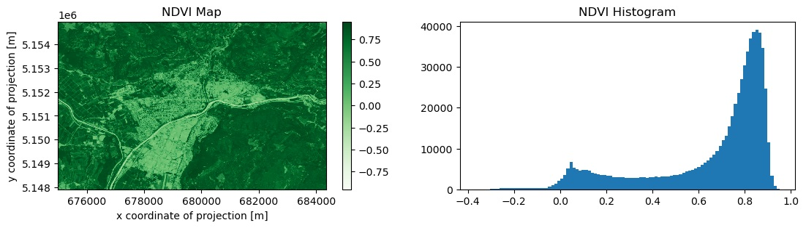

===============================
Client-side (local) processing
===============================

.. warning::
    This is a new experimental feature and API, subject to change.

Background
----------

The client-side processing functionality allows to test and use openEO with its processes locally, i.e. without any connection to an openEO back-end.
It relies on the projects `openeo-pg-parser-networkx <https://github.com/Open-EO/openeo-pg-parser-networkx>`_, which provides an openEO process graph parsing tool, and `openeo-processes-dask <https://github.com/Open-EO/openeo-processes-dask>`_, which provides an Xarray and Dask implementation of most openEO processes. 

Installation
------------

.. note::
    This feature requires ``Python>=3.9`` and has been tested
    with ``openeo-pg-parser-networkx==2023.3.1`` and
    ``openeo-processes-dask==2023.3.2``

.. code:: bash

   pip install openeo[localprocessing]

Usage
-----

Local Collections
~~~~~~~~~~~~~~~~~

Every openEO process graph relies on data, which was always provided by a cloud infrastructure (the openEO back-end) until now.
The client-side processing adds the possibility to read and use local netCDFs, geoTIFFs and ZARR files for your experiments.

If you want to use our sample data, please clone this repository:

.. code:: bash

   git clone https://github.com/Open-EO/openeo-localprocessing-data.git
   
With some sample data we can now check the STAC metadata for the local files by doing:

.. code:: python

   from openeo.local import LocalConnection
   local_data_folders = [
       "./openeo-localprocessing-data/sample_netcdf",
       "./openeo-localprocessing-data/sample_geotiff",
   ]
   local_conn = LocalConnection(local_data_folders)
   local_conn.list_collections()

This code will parse the metadata content of each netCDF, geoTIFF or ZARR file in the provided folders and return a JSON object containing the STAC representation of the metadata.
If this code is run in a Jupyter Notebook, the metadata will be rendered nicely.

.. tip::
    The code expects local files to have a similar structure to the sample files provided `here <https://github.com/Open-EO/openeo-localprocessing-data.git>`_.
    If the code can not handle you special netCDF, you can still modify the function that reads the metadata from it `here <https://github.com/Open-EO/openeo-python-client/blob/90c0505fae47c56746e49c91476be5147be6e1d0/openeo/local/collections.py#L19>`_ and the function that reads the data `here <https://github.com/Open-EO/openeo-python-client/blob/90c0505fae47c56746e49c91476be5147be6e1d0/openeo/local/processing.py#L26>`_.

Local Processing
~~~~~~~~~~~~~~~~

Let's start with the provided sample netCDF of Sentinel-2 data:

.. code-block:: pycon

    >>> local_collection = "openeo-localprocessing-data/sample_netcdf/S2_L2A_sample.nc"
    >>> s2_datacube = local_conn.load_collection(local_collection)
    >>> # Check if the data is loaded correctly
    >>> s2_datacube.execute()
    <xarray.DataArray (bands: 5, t: 12, y: 705, x: 935)>
    dask.array<stack, shape=(5, 12, 705, 935), dtype=float32, chunksize=(1, 12, 705, 935), chunktype=numpy.ndarray>
    Coordinates:
      * t        (t) datetime64[ns] 2022-06-02 2022-06-05 ... 2022-06-27 2022-06-30
      * x        (x) float64 6.75e+05 6.75e+05 6.75e+05 ... 6.843e+05 6.843e+05
      * y        (y) float64 5.155e+06 5.155e+06 5.155e+06 ... 5.148e+06 5.148e+06
        crs      |S1 ...
      * bands    (bands) object 'B04' 'B03' 'B02' 'B08' 'SCL'
    Attributes:
        Conventions:  CF-1.9
        institution:  openEO platform - Geotrellis backend: 0.9.5a1
        description:  
        title:        
    ...

As you can see in the previous example, we are using a call to execute() which will execute locally the generated openEO process graph.
In this case, the process graph consist only in a single load_collection, which performs lazy loading of the data. With this first step you can check if the data is being read correctly by openEO.

Looking at the metadata of this netCDF sample, we can see that it contains the bands B04, B03, B02, B08 and SCL.
Additionally, we also see that it is composed by more than one element in time and that it covers the month of June 2022.

We can now do a simple processing for demo purposes, let's compute the median NDVI in time and visualize the result:

.. code:: python

   b04 = s2_datacube.band("B04")
   b08 = s2_datacube.band("B08")
   ndvi = (b08-b04)/(b08+b04)
   ndvi_median = ndvi.reduce_dimension(dimension="t",reducer="median")
   result_ndvi = ndvi_median.execute()
   result_ndvi.plot.imshow(cmap="Greens")

