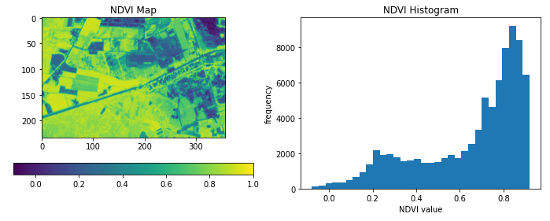

openEO Python Client
=====================

.. image:: https://img.shields.io/badge/Status-Stable-yellow.svg

Welcome to the documentation of ``openeo``,
the official Python client library for interacting with **openEO** back-ends
to process remote sensing and Earth observation data.
It provides a **Pythonic** interface for the openEO API,
supporting data/process discovery, process graph building,
batch job management and much more.

Usage example
-------------

A simple example, to give a feel of using this library:

.. code-block:: python

    import openeo

    # Connect to openEO back-end.
    connection = openeo.connect("openeo.vito.be").authenticate_oidc()

    # Load data cube from TERRASCOPE_S2_NDVI_V2 collection.
    cube = connection.load_collection(
        "TERRASCOPE_S2_NDVI_V2",
        spatial_extent={"west": 5.05, "south": 51.21, "east": 5.1, "north": 51.23},
        temporal_extent=["2022-05-01", "2022-05-30"],
        bands=["NDVI_10M"],
    )
    # Rescale digital number to physical values and take temporal maximum.
    cube = cube.apply(lambda x: 0.004 * x - 0.08).max_time()

    cube.download("ndvi-max.tiff")

Table of contents
-----------------

.. toctree::
   :maxdepth: 2

   self
   installation
   basics
   data_access
   processes
   batch_jobs
   udp
   auth
   udf
   datacube_construction
   machine_learning
   configuration
   cookbook/index
   api
   api-processes
   process_mapping
   development
   best_practices
   changelog

Indices and tables
------------------

* :ref:`genindex`
* :ref:`modindex`
* :ref:`search`
