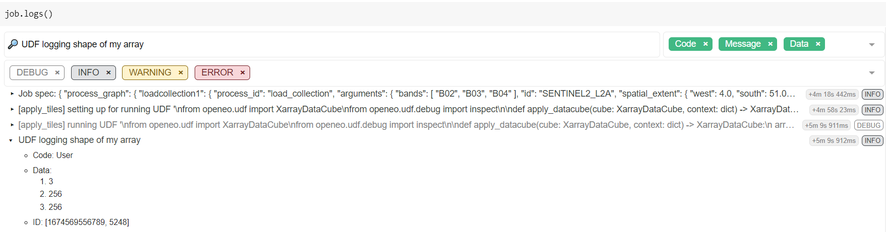

.. index:: User-defined functions
.. index:: UDF

.. _user-defined-functions:

######################################
User-Defined Functions (UDF) explained
######################################


While openEO supports a wide range of pre-defined processes
and allows to build more complex user-defined processes from them,
you sometimes need operations or algorithms that are
not (yet) available or standardized as openEO process.
**User-Defined Functions (UDF)** is an openEO feature
(through the `run_udf <https://processes.openeo.org/#run_udf>`_ process)
that aims to fill that gap by allowing a user to express (a part of)
an **algorithm as a Python/R/... script to be run back-end side**.

There are a lot of details to cover,
but here is a rudimentary example snippet
to give you a quick impression of how to work with UDFs
using the openEO Python Client library:

.. code-block:: python
    :caption: Basic UDF usage example snippet to rescale pixel values

    import openeo

    # Build a UDF object from an inline string with Python source code.
    udf = openeo.UDF("""
    import xarray

    def apply_datacube(cube: xarray.DataArray, context: dict) -> xarray.DataArray:
        cube.values = 0.0001 * cube.values
        return cube
    """)

    # Or load the UDF code from a separate file.
    # udf = openeo.UDF.from_file("udf-code.py")

    # Apply the UDF to a cube.
    rescaled_cube = cube.apply(process=udf)


Ideally, it allows you to embed existing Python/R/... implementations
in an openEO workflow (with some necessary "glue code").
However, it is recommended to try to do as much pre- or postprocessing
with pre-defined processes
before blindly copy-pasting source code snippets as UDFs.
Pre-defined processes are typically well-optimized by the backend,
while UDFs can come with a performance penalty
and higher development/debug/maintenance costs.


.. warning::

    Don not confuse **user-defined functions** (abbreviated as UDF) with
    **user-defined processes** (sometimes abbreviated as UDP) in openEO,
    which is a way to define and use your own process graphs
    as reusable building blocks.
    See :ref:`user-defined-processes` for more information.


Applicability and Constraints
==============================

.. index:: chunking

openEO is designed to work transparently on large data sets
and your UDF has to follow a couple of guidelines to make that possible.
First of all, as data cubes play a central role in openEO,
your UDF should accept and return correct **data cube structures**,
with proper dimensions, dimension labels, etc.
Moreover, the back-end will typically divide your input data cube
in smaller chunks and process these chunks separately (e.g. on isolated workers).
Consequently, it's important that your **UDF algorithm operates correctly
in such a chunked processing context**.

A very common mistake is to use index-based array indexing, rather than name based. The index based approach
assumes that datacube dimension order is fixed, which is not guaranteed. Next to that, it also reduces the readability
of your code. Label based indexing is a great feature of xarray, and should be used whenever possible.

As a rule of thumb, the UDF should preserve the dimensions and shape of the input
data cube. The datacube chunk that is passed on by the backend does not have a fixed
specification, so the UDF needs to be able to accomodate different shapes and sizes of the data.

There's important exceptions to this rule, that depend on the context in which the UDF is used.
For instance, a UDF used as a reducer should effectively remove the reduced dimension from the
output chunk. These details are documented in the next sections.

UDFs as apply/reduce "callbacks"
---------------------------------

UDFs are typically used as "callback" processes for "meta" processes
like ``apply`` or ``reduce_dimension`` (also see :ref:`callbackfunctions`).
These meta-processes make abstraction of a datacube as a whole
and allow the callback to focus on a small slice of data or a single dimension.
Their nature instructs the backend how the data should be processed
and can be chunked:

`apply <https://processes.openeo.org/#apply>`_
    Applies a process on *each pixel separately*.
    The back-end has all freedom to choose chunking
    (e.g. chunk spatially and temporally).
    Dimensions and their labels are fully preserved.
    This function has limited practical use in combination with UDF's.

`apply_dimension <https://processes.openeo.org/#apply_dimension>`_
    Applies a process to all pixels *along a given dimension*
    to produce a new series of values for that dimension.
    The back-end will not split your data on that dimension.
    For example, when working along the time dimension,
    your UDF is guaranteed to receive a full timeseries,
    but the data could be chunked spatially.
    All dimensions and labels are preserved,
    except for the dimension along which ``apply_dimension`` is applied:
    the number of dimension labels is allowed to change.

`reduce_dimension <https://processes.openeo.org/#reduce_dimension>`_
    Applies a process to all pixels *along a given dimension*
    to produce a single value, eliminating that dimension.
    Like with ``apply_dimension``, the back-end will
    not split your data on that dimension.
    The dimension along which ``apply_dimension`` is applied must be removed
    from the output.
    For example, when applying ``reduce_dimension`` on a spatiotemporal cube
    along the time dimension,
    the UDF is guaranteed to receive full timeseries
    (but the data could be chunked spatially)
    and the output cube should only be a spatial cube, without a temporal dimension

`apply_neighborhood <https://processes.openeo.org/#apply_neighborhood>`_
    Applies a process to a neighborhood of pixels
    in a sliding-window fashion with (optional) overlap.
    Data chunking in this case is explicitly controlled by the user.
    Dimensions and number of labels are fully preserved. This is the most versatile
    and widely used function to work with UDF's.


UDF function names and signatures
==================================

The UDF code you pass to the back-end is basically a Python script
that contains one or more functions.
Exactly one of these functions should have a proper UDF signature,
as defined in the :py:mod:`openeo.udf.udf_signatures` module,
so that the back-end knows what the *entrypoint* function is
of your UDF implementation.


Module ``openeo.udf.udf_signatures``
-------------------------------------


.. automodule:: openeo.udf.udf_signatures
 :members:


.. _udf_example_apply:

A first example: ``apply`` with an UDF to rescale pixel values
================================================================

In most of the examples here, we will start from an initial Sentinel2 data cube like this:

.. code-block:: python

    s2_cube = connection.load_collection(
        "SENTINEL2_L2A",
        spatial_extent={"west": 4.00, "south": 51.04, "east": 4.10, "north": 51.1},
        temporal_extent=["2022-03-01", "2022-03-31"],
        bands=["B02", "B03", "B04"]
    )


The raw values in this initial ``s2_cube`` data cube are **digital numbers**
(integer values ranging from 0 to several thousands)
and to get **physical reflectance** values (float values, typically in the range between 0 and 0.5),
we have to rescale them.
This is a simple local transformation, without any interaction between pixels,
which is the modus operandi of the ``apply`` processes.

.. note::

    In practice it will be a lot easier and more efficient to do this kind of rescaling
    with pre-defined openEO math processes, for example: ``s2_cube.apply(lambda x: 0.0001 * x)``.
    This is just a very simple illustration to get started with UDFs. In fact, it's very likely that
    you will never want to use a UDF with apply.

UDF script
----------

The UDF code is this short script (the part that does the actual value rescaling is highlighted):

.. code-block:: python
    :linenos:
    :caption: ``udf-code.py``
    :emphasize-lines: 5

    import xarray

    def apply_datacube(cube: xarray.DataArray, context: dict) -> xarray.DataArray:
        cube.values = 0.0001 * cube.values
        return cube

Some details about this UDF script:

- line 1: We import `xarray` as we use this as exchange format.
- line 3: We define a function named ``apply_datacube``,
  which receives and returns a :py:class:`~xarray.DataArray` instance.
  We follow here the :py:meth:`~openeo.udf.udf_signatures.apply_datacube()` UDF function signature.
- line 4: Because our scaling operation is so simple, we can transform the ``xarray.DataArray`` values in-place.
- line 5: Consequently, because the values were updated in-place, we can return the same Xarray object.

Workflow script
----------------

In this first example, we'll cite a full, standalone openEO workflow script,
including creating the back-end connection, loading the initial data cube and downloading the result.
The UDF-specific part is highlighted.

.. warning::
    This implementation depends on :py:class:`openeo.UDF <openeo.rest._datacube.UDF>` improvements
    that were introduced in version 0.13.0 of the openeo Python Client Library.
    If you are currently stuck with working with an older version,
    check :ref:`old_udf_api` for more information on the difference with the old API.

.. code-block:: python
    :linenos:
    :caption: UDF usage example snippet
    :emphasize-lines: 14-25

    import openeo

    # Create connection to openEO back-end
    connection = openeo.connect("...").authenticate_oidc()

    # Load initial data cube.
    s2_cube = connection.load_collection(
        "SENTINEL2_L2A",
        spatial_extent={"west": 4.00, "south": 51.04, "east": 4.10, "north": 51.1},
        temporal_extent=["2022-03-01", "2022-03-31"],
        bands=["B02", "B03", "B04"]
    )

    # Create a UDF object from inline source code.
    udf = openeo.UDF("""
    import xarray

    def apply_datacube(cube: xarray.DataArray, context: dict) -> xarray.DataArray:
        cube.values = 0.0001 * cube.values
        return cube
    """)

    # Pass UDF object as child process to `apply`.
    rescaled = s2_cube.apply(process=udf)

    rescaled.download("apply-udf-scaling.nc")

In line 15, we build an :py:class:`openeo.UDF <openeo.rest._datacube.UDF>` object
from an inline string with the UDF source code.
This :py:class:`openeo.UDF <openeo.rest._datacube.UDF>` object encapsulates various aspects
that are necessary to create a ``run_udf`` node in the process graph,
and we can pass it directly in line 25 as the ``process`` argument
to :py:meth:`DataCube.apply() <openeo.rest.datacube.DataCube.apply>`.

.. tip::

    Instead of putting your UDF code in an inline string like in the example,
    it's often a good idea to **load the UDF code from a separate file**,
    which is easier to maintain in your preferred editor or IDE.
    You can do that directly with the
    :py:meth:`openeo.UDF.from_file <openeo.rest._datacube.UDF.from_file>` method:

    .. code-block:: python

        udf = openeo.UDF.from_file("udf-code.py")

After downloading the result, we can inspect the band values locally.
Note see that they fall mainly in a range from 0 to 1 (in most cases even below 0.2),
instead of the original digital number range (thousands):

.. image:: _static/images/udf/apply-rescaled-histogram.png


UDF's that transform cube metadata
==================================
This is a new/experimental feature so may still be subject to change.

In some cases, a UDF can have impact on the metadata of a cube, but this can not always
be easily inferred by process graph evaluation logic without running the actual
(expensive) UDF code. This limits the possibilities to validate process graphs,
or for instance make an estimate of the size of a datacube after applying a UDF.

To provide evaluation logic with this information, the user should implement the
:py:meth:`~openeo.udf.udf_signatures.apply_metadata()` function as part of the UDF.
Please refer to the documentation of that function for more information.

.. literalinclude:: ../examples/udf/udf_modify_spatial.py
    :language: python
    :caption: Example of a UDF that adjusts spatial metadata ``udf_modify_spatial.py``
    :name: spatial_udf

To invoke a UDF like this, the apply_neighborhood method is most suitable:

.. code-block:: python

    udf_code = Path('udf_modify_spatial.py').read_text()
    cube_updated = cube.apply_neighborhood(
        lambda data: data.run_udf(udf=udf_code, runtime='Python-Jep', context=dict()),
        size=[
            {'dimension': 'x', 'value': 128, 'unit': 'px'},
            {'dimension': 'y', 'value': 128, 'unit': 'px'}
        ], overlap=[])


Example: ``apply_dimension`` with a UDF
========================================

This is useful when running custom code over all band values for a given pixel or all observations per pixel.
See section below 'Smoothing timeseries with a user defined function' for a concrete example.

Example: ``reduce_dimension`` with a UDF
========================================

The key element for a UDF invoked in the context of `reduce_dimension` is that it should actually return
an Xarray DataArray _without_ the dimension that is specified to be reduced.

So a reduce over time would receive a DataArray with `bands,t,y,x` dimensions, and return one with only `bands,y,x`.


Example: ``apply_neighborhood`` with a UDF
===========================================

The apply_neighborhood process is generally used when working with complex AI models that require a
spatiotemporal input stack with a fixed size. It supports the ability to specify overlap, to ensure that the model
has sufficient border information to generate a spatially coherent output across chunks of the raster data cube.

In the example below, the UDF will receive chunks of 128x128 pixels: 112 is the chunk size, while 2 times 8 pixels of
overlap on each side of the chunk results in 128.

The time and band dimensions are not specified, which means that all values along these dimensions are passed into
the datacube.


.. code-block:: python

    output_cube = inputs_cube.apply_neighborhood(my_udf, size=[
            {'dimension': 'x', 'value': 112, 'unit': 'px'},
            {'dimension': 'y', 'value': 112, 'unit': 'px'}
        ], overlap=[
            {'dimension': 'x', 'value': 8, 'unit': 'px'},
            {'dimension': 'y', 'value': 8, 'unit': 'px'}
        ])


.. warning::

The ``apply_neighborhood`` is the most versatile, but also most complex process. Make sure to keep an eye on the dimensions
and the shape of the DataArray returned by your UDF. For instance, a very common error is to somehow 'flip' the spatial dimensions.
Debugging the UDF locally can help, but then you will want to try and reproduce the input that you get also on the backend.
This can typically be achieved by using logging to inspect the DataArrays passed into your UDF backend side.


Example: Smoothing timeseries with a user defined function (UDF)
==================================================================

In this example, we start from the ``evi_cube`` that was created in the previous example, and want to
apply a temporal smoothing on it. More specifically, we want to use the "Savitzky Golay" smoother
that is available in the SciPy Python library.


To ensure that openEO understand your function, it needs to follow some rules, the UDF specification.
This is an example that follows those rules:

.. literalinclude:: ../examples/udf/smooth_savitzky_golay.py
    :language: python
    :caption: Example UDF code ``smooth_savitzky_golay.py``
    :name: savgol_udf

The method signature of the UDF is very important, because the back-end will use it to detect
the type of UDF.
This particular example accepts a :py:class:`~openeo.rest.datacube.DataCube` object as input and also returns a :py:class:`~openeo.rest.datacube.DataCube` object.
The type annotations and method name are actually used to detect how to invoke the UDF, so make sure they remain unchanged.


Once the UDF is defined in a separate file, we load it
and apply it along a dimension:

.. code-block:: python

    smoothing_udf = openeo.UDF.from_file('smooth_savitzky_golay.py')
    smoothed_evi = evi_cube_masked.apply_dimension(smoothing_udf, dimension="t")


Downloading a datacube and executing an UDF locally
=============================================================

Sometimes it is advantageous to run a UDF on the client machine (for example when developing/testing that UDF).
This is possible by using the convenience function :py:func:`openeo.udf.run_code.execute_local_udf`.
The steps to run a UDF (like the code from ``smooth_savitzky_golay.py`` above) are as follows:

* Run the processes (or process graph) preceding the UDF and download the result in 'NetCDF' or 'JSON' format.
* Run :py:func:`openeo.udf.run_code.execute_local_udf` on the data file.

For example::

    from pathlib import Path
    from openeo.udf import execute_local_udf

    my_process = connection.load_collection(...

    my_process.download('test_input.nc', format='NetCDF')

    smoothing_udf = Path('smooth_savitzky_golay.py').read_text()
    execute_local_udf(smoothing_udf, 'test_input.nc', fmt='netcdf')

Note: this algorithm's primary purpose is to aid client side development of UDFs using small datasets. It is not designed for large jobs.

UDF dependency management
=========================

UDFs usually have some dependencies on existing libraries, e.g. to implement complex algorithms.
In case of Python UDFs, it can be assumed that common libraries like numpy and Xarray are readily available,
not in the least because they underpin the Python UDF function signatures.
More concretely, it is possible to inspect available libraries for the available UDF runtimes
through :py:meth:`Connection.list_udf_runtimes()<openeo.rest.connection.Connection.list_udf_runtimes>`.
For example, to list the available libraries for runtime "Python" (version "3"):

.. code-block:: pycon

    >>> connection.list_udf_runtimes()["Python"]["versions"]["3"]["libraries"]
    {'geopandas': {'version': '0.13.2'},
     'numpy': {'version': '1.22.4'},
     'xarray': {'version': '0.16.2'},
     ...

Managing and using additional dependencies or libraries that are not provided out-of-the-box by a backend
is a more challenging problem and the practical details can vary between backends.


.. _python-udf-dependency-declaration:

Standard for declaring Python UDF dependencies
-----------------------------------------------

.. warning::

    This is based on a fairly recent standard and it might not be supported by your chosen backend yet.


`PEP 723 "Inline script metadata" <https://peps.python.org/pep-0723/>`_ defines a standard
for *Python scripts* to declare dependencies inside a top-level comment block.
If the openEO backend of your choice supports this standard, it is the preferred approach
to declare the (``import``) dependencies of your Python UDF:

- It avoids all the overhead for the UDF developer
  to correctly and efficiently make desired dependencies available in the UDF.
- It allows the openEO backend to optimize dependencies handling.

.. warning::

    An openEO backend might only support this automatic UDF dependency handling feature
    in batch jobs (because of their isolated nature),
    but not for synchronous processing requests.


Declaration of UDF dependencies
```````````````````````````````

A basic example of how the UDF dependencies can be declared in top-level comment block of your Python UDF:

.. code-block:: python
    :emphasize-lines: 1-6

    # /// script
    # dependencies = [
    #   "geojson",
    #   "fancy-eo-library",
    # ]
    # ///
    #
    # This openEO UDF script implements ...
    # based on the fancy-eo-library ... using geosjon data ...

    import geojson
    import fancyeo

    def apply_datacube(cube: xarray.DataArray, context: dict) -> xarray.DataArray:
        ...

Some considerations to make sure you have a valid metadata block:

- Lines start with a single hash ``#`` and one space (the space can be omitted if the ``#`` is the only character on the line).
- The metadata block starts with a line ``# /// script`` and ends with ``# ///``.
- Between these delimiters you put the metadata fields in `TOML format <https://toml.io/en/>`_,
  each line prefixed with ``#`` and a space.
- Declare your UDF's dependencies in a ``dependencies`` field as a TOML array.
  List each package on a separate line as shown above, or put them all on a single line.
  It is also allowed to include comments, as long as the whole construct is valid TOML.
- Each ``dependencies`` entry must be a valid `PEP 508 <https://peps.python.org/pep-0508/>`_ dependency specifier.
  This practically means to use the package names (optionally with version constraints)
  as expected by the ``pip install`` command.

A more complex example to illustrate some more advanced aspects of the metadata block:

.. code-block:: python

    # /// script
    # dependencies = [
    #   # A comment about using at least version 2.5.0
    #   'geojson>=2.5.0',  # An inline comment
    #   # Note that TOML allows both single and double quotes for strings.
    #
    #   # Install a package "fancyeo" from a (ZIP) source archive URL.
    #   "fancyeo @ https://github.com/fncy/fancyeo/archive/refs/tags/v3.2.0-alpha1.zip",
    #   # Or from a wheel URL, including a content hash to be verified before installing.
    #   "lousyeo @ https://example.com/lousyeo-6.6.6-py3-none-any.whl#sha1=4bbb3c72a9234ee998a6de940a148e346a",
    #   # Note that the last entry may have a trailing comma.
    # ]
    # ///


Verification
````````````

Use :py:func:`~openeo.udf.run_code.extract_udf_dependencies` to verify
that your metadata block can be parsed correctly:

.. code-block:: pycon

    >>> from openeo.udf.run_code import extract_udf_dependencies
    >>> extract_udf_dependencies(udf_code)
    ['geojson>=2.5.0',
     'fancyeo @ https://github.com/fncy/fancyeo/archive/refs/tags/v3.2.0-alpha1.zip',
     'lousyeo @ https://example.com/lousyeo-6.6.6-py3-none-any.whl#sha1=4bbb3c72a9234ee998a6de940a148e346a']

If no valid metadata block is found, ``None`` will be returned.

.. note::
    This function won't necessarily raise exceptions for syntax errors in the metadata block.
    It might just fail to reliably detect anything and skip it as regular comment lines.


Ad-hoc dependency handling
---------------------------

If dependency handling through standardized UDF declarations is not supported by the backend,
there are still ways to manually handle additional dependencies in your UDF.
The exact details can vary between backends, but we can give some general pointers here:

- Multiple Python dependencies can be packaged fairly easily by zipping a Python virtual environment.
- For some dependencies, it can be important that the Python major version of the virtual environment is the same as the one used by the backend.
- Python allows you to dynamically append (or prepend) libraries to the search path: ``sys.path.append("unzipped_virtualenv_location")``


Profile a process server-side
==============================


.. warning::
    Experimental feature - This feature only works on back-ends running the Geotrellis implementation, and has not yet been
    adopted in the openEO API.

Sometimes users want to 'profile' their UDF on the back-end. While it's recommended to first profile it offline, in the
same manner as you can debug UDF's, back-ends may support profiling directly.
Note that this will only generate statistics over the python part of the execution, therefore it is only suitable for profiling UDFs.

Usage
------

Only batch jobs are supported! In order to turn on profiling, set 'profile' to 'true' in job options::

        job_options={'profile':'true'}
        ... # prepare the process
        process.execute_batch('result.tif',job_options=job_options)

When the process has finished, it will also download a file called 'profile_dumps.tar.gz':

-   ``rdd_-1.pstats`` is the profile data of the python driver,
-   the rest are the profiling results of the individual rdd id-s (that can be correlated with the execution using the SPARK UI).

Viewing profiling information
------------------------------

The simplest way is to visualize the results with a graphical visualization tool called kcachegrind.
In order to do that, install `kcachegrind <http://kcachegrind.sourceforge.net/>`_ packages (most linux distributions have it installed by default) and it's python connector `pyprof2calltree <https://pypi.org/project/pyprof2calltree/>`_.
From command line run::

       pyprof2calltree rdd_<INTERESTING_RDD_ID>.pstats.

Another way is to use the builtin pstats functionality from within python::

        import pstats
        p = pstats.Stats('restats')
        p.print_stats()

Example
-------


An example code can be found `here <https://github.com/Open-EO/openeo-python-client/tree/master/examples/profiling_example.py>`_ .


.. _udf_logging_with_inspect:

Logging from a UDF
=====================

From time to time, when things are not working as expected,
you may want to log some additional debug information from your UDF, inspect the data that is being processed,
or log warnings.
This can be done using the :py:class:`~openeo.udf.debug.inspect()` function.

For example: to discover the shape of the data cube chunk that you receive in your UDF function:

.. code-block:: python
    :caption: Sample UDF code with ``inspect()`` logging
    :emphasize-lines: 1, 5

    from openeo.udf import inspect
    import xarray

    def apply_datacube(cube: xarray.DataArray, context: dict) -> xarray.DataArray:
        inspect(data=[cube.shape], message="UDF logging shape of my cube")
        cube.values = 0.0001 * cube.values
        return cube

After the batch job is finished (or failed), you can find this information in the logs of the batch job.
For example (as explained at :ref:`batch-job-logs`),
use :py:class:`BatchJob.logs() <openeo.rest.job.BatchJob.logs>` in a Jupyter notebook session
to retrieve and filter the logs interactively:



Which reveals in this example a chunking shape of ``[3, 256, 256]``.

.. note::

    Not all kinds of data (types) are accepted/supported by the ``data`` argument of :py:class:`~openeo.udf.debug.inspect`,
    so you might have to experiment a bit to make sure the desired debug information is logged as desired.


.. _old_udf_api:

``openeo.UDF`` API and usage changes in version 0.13.0
========================================================

Prior to version 0.13.0 of the openEO Python Client Library,
loading and working with UDFs was a bit inconsistent and cumbersome.

- The old ``openeo.UDF()`` required an explicit ``runtime`` argument, which was usually ``"Python"``.
  In the new :py:class:`openeo.UDF <openeo.rest._datacube.UDF>`, the ``runtime`` argument is optional,
  and it will be auto-detected (from the source code or file extension) when not given.
- The old ``openeo.UDF()`` required an explicit ``data`` argument, and figuring out the correct
  value (e.g. something like ``{"from_parameter": "x"}``) required good knowledge of the openEO API and processes.
  With the new :py:class:`openeo.UDF <openeo.rest._datacube.UDF>` it is not necessary anymore to provide
  the ``data`` argument. In fact, while the ``data`` argument is only still there for compatibility reasons,
  it is unused and it will be removed in a future version.
  A deprecation warning will be triggered when ``data`` is given a value.
- :py:meth:`DataCube.apply_dimension() <openeo.rest.datacube.DataCube.apply_dimension>` has direct UDF support through
  ``code`` and ``runtime`` arguments, preceding the more generic and standard ``process`` argument, while
  comparable methods like :py:meth:`DataCube.apply() <openeo.rest.datacube.DataCube.apply>`
  or :py:meth:`DataCube.reduce_dimension() <openeo.rest.datacube.DataCube.reduce_dimension>`
  only support a ``process`` argument with no dedicated arguments for UDFs.

  The goal is to improve uniformity across all these methods and use a generic ``process`` argument everywhere
  (that also supports a :py:class:`openeo.UDF <openeo.rest._datacube.UDF>` object for UDF use cases).
  For now, the ``code``, ``runtime`` and ``version`` arguments are still present
  in :py:meth:`DataCube.apply_dimension() <openeo.rest.datacube.DataCube.apply_dimension>`
  as before, but usage is deprecated.

  Simple example to sum it up:

  .. code-block:: python

        udf_code = """
        ...
        def apply_datacube(cube, ...
        """

        # Legacy `apply_dimension` usage: still works for now,
        # but it will trigger a deprecation warning.
        cube.apply_dimension(code=udf_code, runtime="Python", dimension="t")

        # New, preferred approach with a standard `process` argument.
        udf = openeo.UDF(udf_code)
        cube.apply_dimension(process=udf, dimension="t")

        # Unchanged: usage of other apply/reduce/... methods
        cube.apply(process=udf)
        cube.reduce_dimension(reducer=udf, dimension="t")
